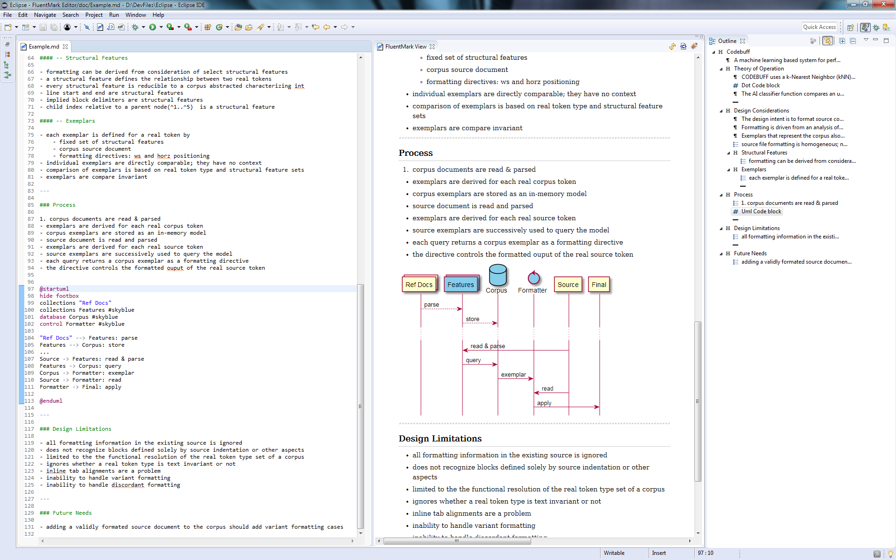

# FluentMark

A full-featured Markdown editing environment for Eclipse.

## Features 

+ Choice of Markdown converter
    - [Pandoc](https://pandoc.org) (preferred)
    - Commonmark ([Flexmark](https://github.com/vsch/flexmark-java) implementation)
    - [BlackFriday](https://github.com/russross/blackfriday)
+ Real-time preview
    - reactively rendered using [Vue.js](https://vuejs.org/)
    - LaTex/Math presentation using [MathJax](https://www.mathjax.org/)
		- Highlighting using [highlightjs](https://highlightjs.org/)
    - stylesheet controlled presentation
        + multiple built-in stylesheets
        + local custom/user defined stylesheets
+ Export to HTML and PDF
  	- PDF export uses Pandoc
  	- supports user-specified latex templates
 
+ Diagram rendering
    - Graph diagrams using the [Graphviz DOT](http://www.graphviz.org/) language
    - UML and other diagrams using the [PlantUml](http://www.graphviz.org/) language
+ Spell check with quick-assist correction processor
+ Smart editing behaviors, including intelligent paragraph, list & blank line handling
+ Table editor
+ Text, list and table formatter
+ Outline view with drag-and-drop support

## Screenshots

<figure>
<figcaption>1. Dot Graph</figcaption>

</figure>

<figure>
<figcaption>2. Sequence Diagram</figcaption>

</figure>


## Installation & Configuration

Requires Eclipse 2020-06 & JDK 1.8+.

Install from the Certiv Tools update site: [www.certiv.net/updates](http://www.certiv.net/updates/).

Preferences ---

- `Window`&rarr;`Certiv Tools`&rarr;`FluentMark`

Pandoc converter ---

- Install [Pandoc](https://pandoc.org). The `pandoc` executable can then be selected from the local filesystem 
  on the Pandoc Converter preference page.

PDF export ---

- Both *Pandoc* and a _LaTeX_ processor must be installed. Pandoc recommends [*MikTeX*](https://miktex.org/).

DOT graphics ---

- Install [Graphviz](http://www.graphviz.org/download.php). The `dot` executable can then be selected 
  on the Converter preference page.

UML and other diagrams ---

- The basic PlantUml jar is built-in. Diagrams other than sequence diagrams require DOT graphics. If 
  `Graphviz` is installed in a non-default directory, set the `GRAPHVIZ_DOT` environment variable to 
  the actual installation directory.

BlackFriday converter ---

- Install the customized [blackfriday-tool](https://github.com/grosenberg/blackfriday-tool) from GitHub. 
  A Windows 64-bit compiled executable is available for download: [blackfriday-tool.zip](http://www.certiv.net/updates/net.certiv.fluentmark.site/blackfriday-tool.zip). 
  The `blackfriday-tool` executable can then be selected on the BlackFriday Converter preference page.
  

## Use

### Keys

|Key             |Function                                         |
|:---------------|:------------------------------------------------|
|Ctrl-Space      |Open quick assist popup                          |
|Ctrl-1          |Spellcheck quick correct                         |
|Ctrl-b          |Toggle **bold** of selected text                 |
|Ctrl-i          |Toggle _italics_ of selected text                |
|Ctrl-/          |Toggle Markdown-style commenting of selected text|
|Ctrl-Shift-/    |Toggle HTML-style commenting of selected text    |
|Ctrl-Shift-f    |Format - full page or selected text              |
|Ctrl-Shift-Alt-f|Format - with unwrapped text                     |

### Table Editor

`Double-click` on an existing table to open the table editor. While in the editor, `double-click` a cell to edit 
text. `Tab` and arrow keys will navigate between cells. `Return` to end cell editing.


## Support

Open an [issue on Github](https://github.com/grosenberg/fluentmark/issues). Provide as much information as possible

- a minimal Markdown document that demonstrates the issue 
- OS name and version version 
- the error message encountered 

## Resources

1. Markdown Syntax
    - [Pandoc's Markdown Documentation](https://pandoc.org/MANUAL.html#pandocs-markdown)
    - [CommonMark Spec 0.29](https://spec.commonmark.org/0.29/)
1. MathJax TeX Commands 
    - [TeX Syntax Documentation](https://www.onemathematicalcat.org/MathJaxDocumentation/TeXSyntax.htm)
1. PlantUML Language
  	- [Language Specification](https://plantuml.com/sitemap-language-specification)
1. Graphviz 'Dot' Language 
	  - [Dot Man Page](http://www.graphviz.org/pdf/dot.1.pdf)
1. LaTex Templates for Pandoc PDF generation:
	  - [LaTex Templates](https://github.com/topics/latex-template "Latex Templates") on Github.

## License

EPL v1


--- 

## Spans and Blocks

### HTML

Raw HTML can be used both in-line and as left margin blocks delimited by `blank` lines.


---

### In-line Math 

In-line Math uses single `$` open/close delimiters. Can be embedded in other markdown features.

The opening `$` _must_ have a non-space character immediately right.  The closing `$` _must_ have a 
non-whitespace character immediately left and _must_ be followed immediately by a non-digit or whitespace. 

```
An inline math $1+2\neq3$! example.
```

renders to

An inline math $1+2\neq3$! example.
 
---

### Math Blocks

Simple math blocks are delimited using double `$`, *i.e.*, `$$`, marks at the left margin. The starting 
delimiter *must* follow a blank line and the ending delimiter *must* lead a blank line.

~~~ latex
<<blank line>>
$$
 u(x) =
  \begin{cases}
   \exp{x} & \text{if } x \geq 0 \\
   1       & \text{if } x < 0
  \end{cases}
$$
<<blank line>>
~~~

renders to

$$
 u(x) =
  \begin{cases}
   \exp{x} & \text{if } x \geq 0 \\
   1       & \text{if } x < 0
  \end{cases}
$$

---

### LaTex Block

Delimited by the Latex standard **`\begin{...}`** and **`\end{...}`** keywords. These keywords *must* both be 
left-margin aligned. The block *must* be separated from all other content by blank lines. 

~~~ latex
<<blank line>>
\begin{equation} 
	f(x)=(x+a)(x+b)
\end{equation}
<<blank line>>
~~~

renders to

\begin{equation}
  f(x)=(x+a)(x+b)
\end{equation}

---

