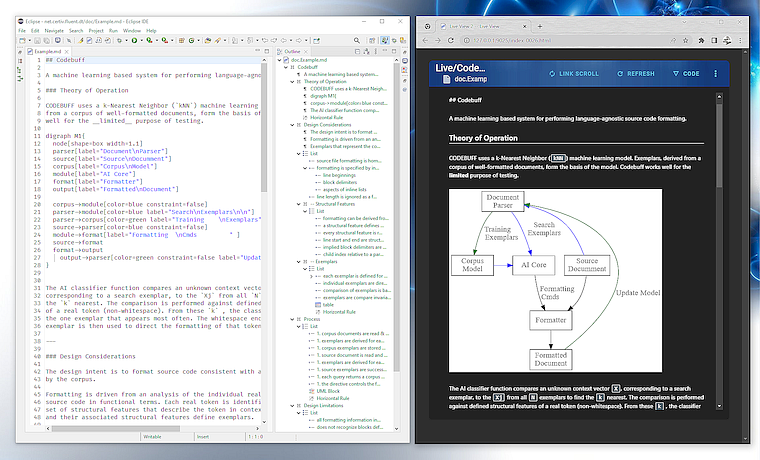

 

# FluentMark

A full-featured Markdown editing environment for Eclipse.

## Features 

+ Standard Markdown syntax 
+ Extended syntax
	+ Html - inline & block
	+ Math - inline & block
	+ Latex - inline & block
	+ Graphs - [Graphviz Dot](http://www.graphviz.org/) language block
	+ Uml - [PlantUml](http://www.graphviz.org/) language block 
+ Liveview - real-time external browser rendered preview
    - reactive rendering using [Vue.js](https://vuejs.org/)
    - math presentation using [MathJax](https://www.mathjax.org/)
    - code highlighting using [highlightjs](https://highlightjs.org/)
+ Spell check with quick-assist correction processor

+ Smart editing behaviors, including intelligent paragraph, list & blank line handling+ Table editor
+ Text, list and table formatter
+ Optional stylesheet controlled editor presentation
+ Outline view with drag-and-drop support

## Use

Main toolbar

<ol>
<li>Mark occurrences 
<li>Live view 
<li>Export to HTML
<li>Export to PDF
<li>Show Whitespace Characters
<li>Word Wrap (_aka_ Soft Line Wrap)
</ol>

Details on [how to use](https://github.com/grosenberg/Fluentmark/blob/master/doc/Use.md) Fluentmark. 

Details on the [Semantic Styling](https://github.com/grosenberg/Fluentmark/blob/master/doc/EditorCss.md) feature.

## Screenshot

<figure>
	

  <figcaption>Graph presentation using Graphviz Dot</figcaption>
</figure>

## Installation 

Installation:

Certiv Tools update site: `https://www.certiv.net/updates`
 
Requirements

- Eclipse 2021-03
- JDK 11+
- [Graphviz](http://www.graphviz.org/download.php) for Dot and PlantUml language blocks 
- [Pandoc](https://pandoc.org) and a _LaTeX_ processor (like [*MikTeX*](https://miktex.org/)) for Html and Pdf export

## Configuration

Eclipse Preference pages ---

> `Window` -> `Certiv Tools` -> `FluentMark`

To use the Pandoc converter, select the `pandoc` executable from the local filesystem on the Pandoc Converter tab. 

To use Graphviz Dot, select the `dot` executable on the Fluentmark preference page. Note, if `Graphviz` is installed in a non-default directory, PlantUML requres that the `GRAPHVIZ_DOT` environment variable be set to the actual installation directory.

To use the BlackFriday converter, install the customized [blackfriday-tool](https://github.com/grosenberg/blackfriday-tool) from GitHub. A Windows 64-bit compiled executable is available for download [blackfriday-tool.zip](http://www.certiv.net/updates/net.certiv.fluentmark.site/blackfriday-tool.zip). The `blackfriday-tool` executable can then be selected on the BlackFriday Converter tab.

## Support

Open an [issue on Github](https://github.com/grosenberg/fluentmark/issues). Provide as much information as possible:

- a minimal Markdown document that demonstrates the issue(s)
- the error message(s) encountered 
- OS, Eclipse and JDK versions

## Resources

1. Markdown Syntax
    - [Pandoc's Markdown Documentation](https://pandoc.org/MANUAL.html#pandocs-markdown)
    - [CommonMark Spec 0.29](https://spec.commonmark.org/0.29/)
1. [TeX Syntax Documentation](https://www.onemathematicalcat.org/MathJaxDocumentation/TeXSyntax.htm)
    - [Templates](https://github.com/topics/latex-template "Latex Templates") for PDF generation
1. [PlantUML Language Specification](https://plantuml.com/sitemap-language-specification)
    - [Ashley’s PlantUML Documentation](https://plantuml-documentation.readthedocs.io/en/latest/index.html)
    - [C4 Model for Software Architecture Diagrams](https://github.com/plantuml-stdlib/C4-PlantUML)
1. [Graphviz Documentation](https://www.graphviz.org/documentation/)
    - [Arrow Shapes](https://www.graphviz.org/doc/info/arrows.html)
    - [Node Shapes](https://graphviz.org/doc/info/shapes.html)
    - [Dot Manpage](http://www.graphviz.org/pdf/dot.1.pdf)

## License

EPL 

