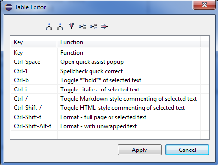

# FluentMark

A full-featured Markdown editing environment for Eclipse.

### Use

- [Toolbar](#toolbar)
- [Keys](#keys)
- [Semantic Styles](https://github.com/grosenberg/Fluentmark/blob/master/doc/EditorCss.md)
- [Table Editor](#table-editor)
- [HTML Spans and Blocks](#html-spans-and-blocks)
- [Graphviz Dot Blocks](#graphviz-dot-blocks)
- [PlantUml Blocks](#plantuml-blocks)
- [In-line Math Statements](#in-line-math-statements)
- [Math Blocks](#math-blocks)
- [LaTex Blocks](#latex-blocks)

----

## Toolbar

<figure> 
	 
</figure>

When a Fluentmark editor is active, the Eclipse toolbar is populated with buttons to

- open a Live view of the current editor contents
- export a standalone HTML page rendered from the current editor contents
- save a PDF rendered from the current editor contents  


## Keys

|Key             |Function                                         |
|:---------------|:------------------------------------------------|
|Ctrl-Space      |Open quick assist popup                          |
|Ctrl-1          |Spellcheck quick correct                         |
|Ctrl-b          |Toggle **bold** of selected text                 |
|Ctrl-i          |Toggle _italics_ of selected text                |
|Ctrl-/          |Toggle Markdown-style commenting of selected text|
|Ctrl-Shift-/    |Toggle HTML-style commenting of selected text    |
|Ctrl-Shift-f    |Format - full page or selected text              |
|Ctrl-Shift-Alt-f|Format - with unwrapped text                     |


## Table Editor

Fluentmark supports standard markdown tables with the addition of a table editor.

To open the table editor pop-up, `double-click` an existing markdown table. 

<figure> 
	 
	<figcaption>Table Editor</figcaption> 
</figure>

Within the editor, `double-click` a table cell to edit text. `Tab` and arrow keys 
will navigate between cells. Press `Enter` to end cell editing.


## HTML Spans and Blocks

Raw HTML can be used both <strong>in-line spans</strong> and blocks.  

Inline can appear anywhere in a line and span multiple lines. 

The first and last lines of a HTML block _must_ be left-margin aligned and delimited 
by `blank` lines.

```
An <b>inline span</b> and a left-aligned block: 

<<blank line>>
<figure>
	 
	<figcaption>Table Editor</figcaption> 
</figure>
<<blank line>>

```

## Graphs

Fluentmark can recognize Graphviz Dot and PlantUml graph descriptions either natively 
or within delimited code blocks with appropriate language names 

### Native

A native Graphviz Dot Block is recognized by the _`digraph`_ keyword and continues to the end of the 
balanced `{` ... `}` body.  The first and last lines _must_ be left-margin aligned and 
further delimited by `blank` lines.

```
<<blank line>>
digraph X1 {
    a-> b -> c -> a 
}
<<blank line>>

```

A native PlantUML Block is recognized by the _`@startXXX`_ and _`@endXXX`_ keywords (where 
`XXX` is typically `uml`). These keyword lines _must_ be left-margin aligned and 
further delimited by `blank` lines.

```  
<<blank line>>
@startuml
    Alice -> Bob  : Authentication Request
    Bob --> Alice : Authentication Response

    Alice ->   Bob : Second authentication Request
    Alice <--o Bob : Second authentication Response
@enduml 
<<blank line>>

```

### Code block delimited

Place the graph description -- same as above, though without the blank line restriction 
-- within standard code block delimiters.

```
\``` dot
digraph X1 {
    a-> b -> c -> a 
}
\```
```

```  
\``` uml
@startuml
    Alice -> Bob  : Authentication Request
    Bob --> Alice : Authentication Response

    Alice ->   Bob : Second authentication Request
    Alice <--o Bob : Second authentication Response
@enduml 
\```
```


## In-line Math 

In-line Math uses single `$` open/close delimiters. Can be embedded in other markdown 
features.

The opening `$` _must_ have a non-space character immediately right.  The closing 
`$` _must_ have a non-whitespace character immediately left and _must_ be followed 
immediately by a non-digit or whitespace. 

```
An inline math $1+2\neq3$! example.
```
 
## Math Blocks

Math blocks are delimited using `$$` marks at the left margin. The starting delimiter _must_
follow a blank line and the ending delimiter _must_ lead a blank line.

~~~ latex
<<blank line>>
$$
 u(x) =
  \begin{cases}
   \exp{x} & \text{if } x \geq 0 \\
   1       & \text{if } x < 0
  \end{cases}
$$
<<blank line>>
~~~

## LaTex Blocks

LaTex Block are delimited by the standard _`\begin{...}`_ and _`\end{...}`_ statements. Both statements _must_ 
be left-margin aligned  and further delimited by leading and trailing blank lines.

~~~ latex
<<blank line>>
\begin{equation} 
	f(x)=(x+a)(x+b)
\end{equation}
<<blank line>>
~~~
